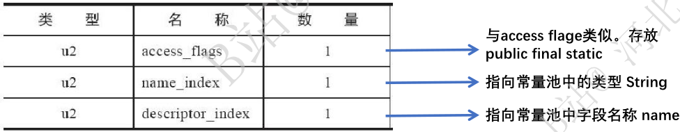
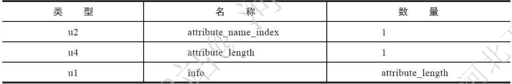
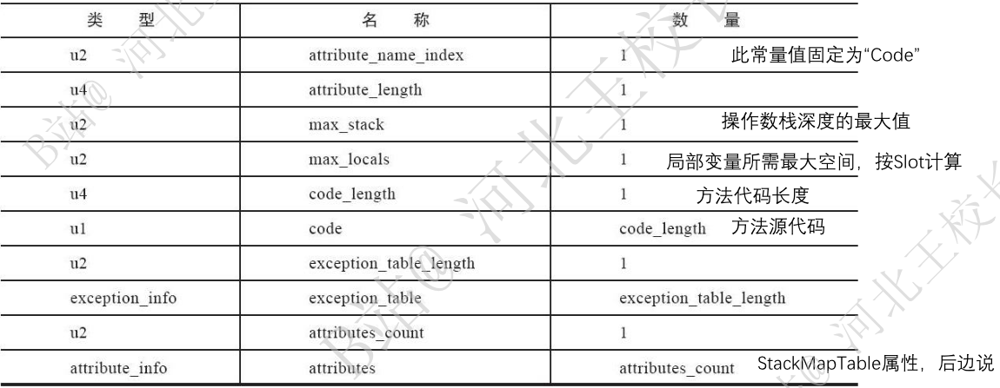

# jvm 汇总

## 类索引、父类索引和接口索引集合的作用

类索引(this_class)、和父类索引(super_class)都是一个 u2 类型的数据，而接口索引集合(interface)是一组 u2 类型数据的集合，class 文件中由这三项来确定类的继承实现关系。

类索引用于确定这个类的全限定名，父类索引用于确定这个类父类的全限定名。这些索引指向常量池中的 constant_clas_info 类型，constant_class_info 又指向了 constant_utf8_info 从而最终找到全限定名。

## class 文件中字段表存储什么信息，与常量池有什么联系

字段表(field_info)用于描述接口或者类中声明的变量。包括类级变量以及实例变量，但不包括在方法内部声明的局部变量。

字段表存储的其实是变量的修饰符+字段描述符索引(索引指向常量池)+字段名称索引(索引指向常量池)。

修饰符：字段的作用域(public、private、protected 修饰符)、是实例变量还是类变量(static修饰符)、可变性(final)、并发可见性(volatile)、可否被序列化(transient)等。

描述符：字段类型存放于常量池中

## class 文件的方法表存储什么信息、与常量池有什么关系

方法表的结构如同字段表几乎一样以此包含：访问标识、名称索引、描述符索引、属性表集合几项

## class 文件结构属性表的理解

class文件、字段表、方法表都可以携带自己的属性表(attribute_info)集合，以描述某些场景专有的信息。属性表集合的限制稍微宽松一点，允许只要不与已有的属性名重复，任何人实现的编译器都可以向属性表中写入自己定义的属性信息。

对于每一个属性，它的名称都要从常量池中引用一个 constant_urf8_info 类型的常量来表示，而属性值的结构则是完全自定义的，只要通过一个 u4 长度的属性去说明所占的位数即可。

code 属性：java 程序方法体里面的代码经过 java 编译器处理之后，最终变为字节码指令存储在 code 属性内。code 属性出现在方法表的属性集合之中，但并非所有的方法表都必须存在这个属性，譬如接口或者抽象类中的方法就不存在 code 属性。

LineNumberTable 属性：用于描述 java 源码行号与字节码行号(字节码偏移量)之间的对应关系，并不是必须的的属性但是默认会生成到 class 文件中。如果选择不生成，最主要的影响在抛出异常时，堆栈中不会显示错误行号。

ConstantValue 属性：作用是通知虚拟机自动为静态变量赋值。只有被 static 关键字修饰的变量(类变量)才可以使用这项属性。虚拟机对这两种变量赋值的方式和时刻都有所不同。对非 static 类型的变量（也就是实例变量）的赋值是在实例构造器< init >()方法中进行的；而对于类变量，则有两种方式可以选择：在类构造器< clinit >()方法中或者使用ConstantValue 属性。目前 Oracle 公司实现的Javac编译器的选择是，如果同时使用 final 和 static 来修饰一个变量（按照习惯，这里称“常量”更贴切），并且这个变量的数据类型是基本类型或者java.lang.String的话，就将会生成ConstantValue 属性来进行初始化；如果这个变量没有被 final 修饰，或者并非基本类型及字符串，则将会选择在< clinit >()方法中进行初始化。

## jvm 类加载的整体流程

主要分为三步：加载、链接、初始化
链接又分为三步：验证、准备、解析

具体流程
加载
通过一个类的全限定名称来获取此类的二进制字节流（初次获取 class 文件字节流）
链接：验证 文件格式验证
class 文件格式验证主要验证魔术是否以 cafe baby 开头
加载
将这个字节流所代表的 class 文件本身结构转化为方法的运行时数据结构
加载
在内存 java 堆中生成这个类的 java.lang.Class 对象，作为方法区这个类的各种数据访问入口
链接：验证 元数据验证
链接：验证 字节码验证
链接：准备
链接：解析
解析中并进行符号引用的验证
初始化

准确的说，类加载是从加载开始，但是加载和链接有交叉进行的部分，解析的时候也难以确定，但大体的类加载流程既是如此。

### 加载阶段 jvm 具体进行的操作

加载阶段是整个类加载过程中的一个阶段，在加载阶段 java 虚拟机需要完成以下三件事情
