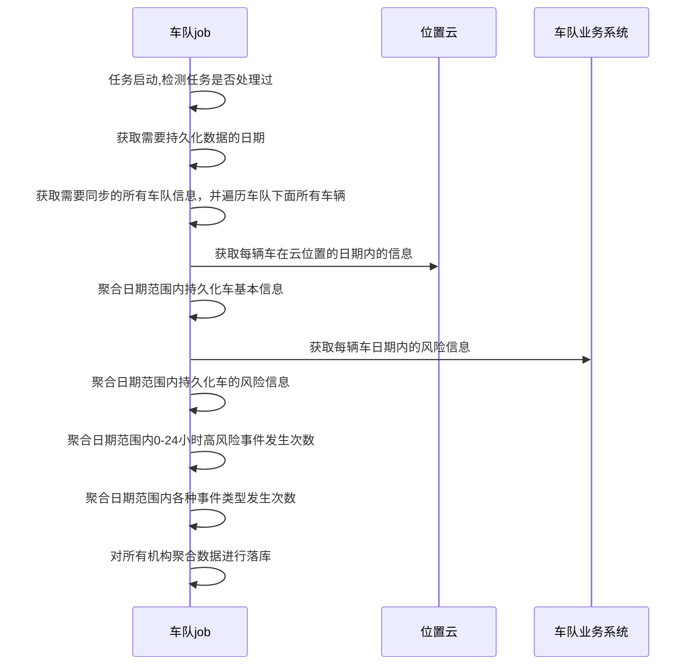

# 车队版本迭代

## 义乌德翔客户需要车联网数据，里程、车速、油耗等字段数据接口

车队编号：0000001060

正式环境 token：39c411664b32469aa2d8cfc21380c626

```shell
# 位置云
http://sy.smartlink-tech.com.cn:81/test/fawcld/api/faw/rest/doc.html
http://sy.smartlink-tech.com.cn:81/test/fawcld/api/faw/rest-kudu/doc.html#/home
```

```sql
# 车辆主数据表
select * from c_base_info;
# 车队主数据表
select * from u_team;
# 车辆与车队关联数据表
select * from c_team_mapping
# 车辆报警信息表
select * from a_message_2021_05 order by create_time desc;
# 车辆报警类型表
select * from s_dictionary where dict_type_code = 'MESSAGE_TYPE';

# 需求 SQL
SELECT * 
FROM a_message_2021_05 am 
WHERE am.vehicle_tid IN (
	SELECT tid
	FROM c_base_info
	WHERE id IN (
		SELECT car_id
		FROM c_team_mapping
		WHERE team_code='0000001060'
	)
) 
AND am.message_type IN (
	SELECT dict_code 
	FROM s_dictionary 
	WHERE dict_type_code = 'MESSAGE_TYPE' 
	AND dict_name IN ('超时停车','超速报警','油耗异常','加油异常')
);
```

## v2.4.0 版本

1. ~~与赋界卡维修保打通(数据从寰游同步，另外需要查寻接口)~~
2. ~~风险计算方式优化(flink 算法修改)~~
3. 车队服务号权限优化
4. ~~视频设置操作逻辑补充(视频设置可能需要跟终端发送指令)~~
5. ~~安全管家/风险统计报表-里程字段无单位，增加 km(前端工作)~~
6. ~~监控中心(前端工作)~~
    1. 实时视频摄像头3,4为无效摄像头，建议隐藏；
    2. 点击页面后，立刻出现实时视频
7. ~~服务号风险事件推送运营启动~~(当前版本不做)
8. 机构未安装硬件车辆为0,则不显示机构名称(预测是否只查询有机构绑定的车辆筛选即可)
9. 报警中心—车辆超时停车报警次数不合理(优化停车超车flink逻辑)
10. ~~风险事件明细 - 日期时间范围筛选规则优化(预测前端工作)~~
11. 全图监控-车辆小卡片行驶里程定义有问题
     1. 当日里程 http://sy.smartlink-tech.com.cn:81/smartteam/test/local/truck/card/info?vin=LFWSRXSJ3L1F66737
      2. com.faw.smart.team.service.LocationService#getTruckTrailTotal
12. 菜单逻辑需要规整规整(后端调增菜单表sql)
     1. 需要将对应的数据 seq 改为 1 即可
13. ~~信息管理-增加设备管理(接入方案要么出接口给我们推送，要么导入，增删改查接口)~~**暂停**
14. 需要把无tbox车辆做标记，比如：苏A77890（无tbox，无adas，设备状态)(接入方案要么出接口给我们推送，要么导入，增删改查接口)
15. ~~风险分析-精确到日，根据首页分析布局调整，优化整合风险分析页面~~(没有原型。暂时不知道后端是否需要开发)
16. ~~安全报警事件视频时间长度增加~~(硬件和前端的问题，后端应该没有工作量)
17. RiskMonitorController 实时风险
     InterveneManageController 干预明细
     VoiceDistributeController 干预操作

车辆基础数据有adas刷渠道1、渠道2

```sql
# 执行之前先查询出对应的数据然后用 id 去做操作
# c_base_info 刷数据
需要生产 adas 数据
# 1.将不等于生产使用 adas 的数据并且 tid=adas 的数据 tid 清空
update c_base_info
set tid = '', car_owner='1'
where slave_gpsno is not null
  and slave_gpsno <> ''
  and tid=slave_gpsno
  and slave_gpsno not in (
                          
    );
# 2.将不等于生产使用 adas 的数据，adas 字段清空
update c_base_info
set slave_gpsno = '', car_owner='0'
where slave_gpsno is not null
  and slave_gpsno <> ''
  and slave_gpsno not in (
                          
    );
# 3.将生产 tid=adas 的数据 tid 清空
update c_base_info
set tid = '', car_owner='0'
where slave_gpsno is not null
  and slave_gpsno <> ''
  and tid=slave_gpsno
  and slave_gpsno in (
  
  );
```

```sql
alter table a_message_2019_07
	add driver_no int(11) null comment '司机编号';
alter table a_message_2019_08
	add driver_no int(11) null comment '司机编号';
alter table a_message_2019_09
	add driver_no int(11) null comment '司机编号';
alter table a_message_2019_10
	add driver_no int(11) null comment '司机编号';
alter table a_message_2019_11
	add driver_no int(11) null comment '司机编号';
alter table a_message_2019_12
	add driver_no int(11) null comment '司机编号';
	
alter table a_message_2020_01
	add driver_no int(11) null comment '司机编号';
alter table a_message_2020_02
	add driver_no int(11) null comment '司机编号';
alter table a_message_2020_03
	add driver_no int(11) null comment '司机编号';
alter table a_message_2020_04
	add driver_no int(11) null comment '司机编号';
alter table a_message_2020_05
	add driver_no int(11) null comment '司机编号';
alter table a_message_2020_06
	add driver_no int(11) null comment '司机编号';
alter table a_message_2020_07
	add driver_no int(11) null comment '司机编号';
alter table a_message_2020_08
	add driver_no int(11) null comment '司机编号';
alter table a_message_2020_09
	add driver_no int(11) null comment '司机编号';
alter table a_message_2020_10
	add driver_no int(11) null comment '司机编号';
alter table a_message_2020_11
	add driver_no int(11) null comment '司机编号';
alter table a_message_2020_12
	add driver_no int(11) null comment '司机编号';
alter table a_message_2021_01
	add driver_no int(11) null comment '司机编号';
alter table a_message_2021_02
	add driver_no int(11) null comment '司机编号';
alter table a_message_2021_03
	add driver_no int(11) null comment '司机编号';
alter table a_message_2021_04
	add driver_no int(11) null comment '司机编号';
alter table a_message_2021_05
	add driver_no int(11) null comment '司机编号';
alter table a_message_2021_06
	add driver_no int(11) null comment '司机编号';
alter table a_message_2021_07
	add driver_no int(11) null comment '司机编号';
alter table a_message_2021_08
	add driver_no int(11) null comment '司机编号';
alter table a_message_2021_09
	add driver_no int(11) null comment '司机编号';
alter table a_message_2021_10
	add driver_no int(11) null comment '司机编号';
alter table a_message_2021_11
	add driver_no int(11) null comment '司机编号';
alter table a_message_2021_12
	add driver_no int(11) null comment '司机编号';
	
alter table a_message_2019_07
	add alarm_state int(11) default 1 null comment '告警状态';
alter table a_message_2019_08
	add alarm_state int(11) default 1 null comment '告警状态';
alter table a_message_2019_09
	add alarm_state int(11) default 1 null comment '告警状态';
alter table a_message_2019_10
	add alarm_state int(11) default 1 null comment '告警状态';
alter table a_message_2019_11
	add alarm_state int(11) default 1 null comment '告警状态';
alter table a_message_2019_12
	add alarm_state int(11) default 1 null comment '告警状态';
alter table a_message_2020_01
	add alarm_state int(11) default 1 null comment '告警状态';
alter table a_message_2020_02
	add alarm_state int(11) default 1 null comment '告警状态';
alter table a_message_2020_03
	add alarm_state int(11) default 1 null comment '告警状态';
alter table a_message_2020_04
	add alarm_state int(11) default 1 null comment '告警状态';
alter table a_message_2020_05
	add alarm_state int(11) default 1 null comment '告警状态';
alter table a_message_2020_06   
	add alarm_state int(11) default 1 null comment '告警状态';
alter table a_message_2020_07   
	add alarm_state int(11) default 1 null comment '告警状态';
alter table a_message_2020_08   
	add alarm_state int(11) default 1 null comment '告警状态';
alter table a_message_2020_09   
	add alarm_state int(11) default 1 null comment '告警状态';
alter table a_message_2020_10   
	add alarm_state int(11) default 1 null comment '告警状态';
alter table a_message_2020_11   
	add alarm_state int(11) default 1 null comment '告警状态';
alter table a_message_2020_12   
	add alarm_state int(11) default 1 null comment '告警状态';
alter table a_message_2021_01   
	add alarm_state int(11) default 1 null comment '告警状态';
alter table a_message_2021_02   
	add alarm_state int(11) default 1 null comment '告警状态';
alter table a_message_2021_03   
	add alarm_state int(11) default 1 null comment '告警状态';
alter table a_message_2021_04   
	add alarm_state int(11) default 1 null comment '告警状态';
alter table a_message_2021_05   
	add alarm_state int(11) default 1 null comment '告警状态';
alter table a_message_2021_06   
	add alarm_state int(11) default 1 null comment '告警状态';
alter table a_message_2021_07   
	add alarm_state int(11) default 1 null comment '告警状态';
alter table a_message_2021_08   
	add alarm_state int(11) default 1 null comment '告警状态';
alter table a_message_2021_09   
	add alarm_state int(11) default 1 null comment '告警状态';
alter table a_message_2021_10   
	add alarm_state int(11) default 1 null comment '告警状态';
alter table a_message_2021_11   
	add alarm_state int(11) default 1 null comment '告警状态';
alter table a_message_2021_12   
	add alarm_state int(11) default 1 null comment '告警状态';
```

```sql
create table c_video_channel
(
    id           int auto_increment comment '主键'
        primary key,
    channel_name varchar(16)                         not null comment '渠道名称',
    remark       varchar(128)                        null comment '备注信息',
    create_time  timestamp default CURRENT_TIMESTAMP not null,
    update_time  timestamp default CURRENT_TIMESTAMP null
)
    comment '车辆视频监控渠道';
    
insert into c_video_channel (channel_name) values ('通道-1');
insert into c_video_channel (channel_name) values ('通道-2');
insert into c_video_channel (channel_name) values ('通道-3');
insert into c_video_channel (channel_name) values ('通道-4');

alter table c_base_info
	add channel_id varchar(64);
```

```sql
alter table e_risk_2019_10
	add driver_no int(11) null comment '司机编号';
alter table e_risk_2019_10
	add process_no int(11) null comment '处理人编号';
alter table e_risk_2019_10
	add process_status int(11) null comment '处理状态';
alter table e_risk_2019_10
	add process_time datetime null comment '处理时间';
	
alter table e_risk_2019_11
	add driver_no int(11) null comment '司机编号';
alter table e_risk_2019_11
	add process_no int(11) null comment '处理人编号';
alter table e_risk_2019_11
	add process_status int(11) null comment '处理状态';
alter table e_risk_2019_11
    add process_time datetime null comment '处理时间';
	
alter table e_risk_2019_12
	add driver_no int(11) null comment '司机编号';
alter table e_risk_2019_12
	add process_no int(11) null comment '处理人编号';
alter table e_risk_2019_12
	add process_status int(11) null comment '处理状态';
alter table e_risk_2019_12
    add process_time datetime null comment '处理时间';
	
alter table e_risk_2020_01
	add driver_no int(11) null comment '司机编号';
alter table e_risk_2020_01
	add process_no int(11) null comment '处理人编号';
alter table e_risk_2020_01
	add process_status int(11) null comment '处理状态';
alter table e_risk_2020_01
    add process_time datetime null comment '处理时间';
	
alter table e_risk_2020_02
	add driver_no int(11) null comment '司机编号';
alter table e_risk_2020_02
	add process_no int(11) null comment '处理人编号';
alter table e_risk_2020_02
	add process_status int(11) null comment '处理状态';
alter table e_risk_2020_02
    add process_time datetime null comment '处理时间';
	
alter table e_risk_2020_03
	add driver_no int(11) null comment '司机编号';
alter table e_risk_2020_03
	add process_no int(11) null comment '处理人编号';
alter table e_risk_2020_03
	add process_status int(11) null comment '处理状态';
alter table e_risk_2020_03
    add process_time datetime null comment '处理时间';
	
alter table e_risk_2020_04
	add driver_no int(11) null comment '司机编号';
alter table e_risk_2020_04
	add process_no int(11) null comment '处理人编号';
alter table e_risk_2020_04
	add process_status int(11) null comment '处理状态';
alter table e_risk_2020_04
    add process_time datetime null comment '处理时间';
	
alter table e_risk_2020_05
	add driver_no int(11) null comment '司机编号';
alter table e_risk_2020_05
	add process_no int(11) null comment '处理人编号';
alter table e_risk_2020_05
	add process_status int(11) null comment '处理状态';
alter table e_risk_2020_05
    add process_time datetime null comment '处理时间';
	
alter table e_risk_2020_06
	add driver_no int(11) null comment '司机编号';
alter table e_risk_2020_06
	add process_no int(11) null comment '处理人编号';
alter table e_risk_2020_06
	add process_status int(11) null comment '处理状态';
alter table e_risk_2020_06
    add process_time datetime null comment '处理时间';
	
alter table e_risk_2020_07
	add driver_no int(11) null comment '司机编号';
alter table e_risk_2020_07
	add process_no int(11) null comment '处理人编号';
alter table e_risk_2020_07
	add process_status int(11) null comment '处理状态';
alter table e_risk_2020_07
    add process_time datetime null comment '处理时间';
	
alter table e_risk_2020_08
	add driver_no int(11) null comment '司机编号';
alter table e_risk_2020_08
	add process_no int(11) null comment '处理人编号';
alter table e_risk_2020_08
	add process_status int(11) null comment '处理状态';
alter table e_risk_2020_08
    add process_time datetime null comment '处理时间';
	
alter table e_risk_2020_09
	add driver_no int(11) null comment '司机编号';
alter table e_risk_2020_09
	add process_no int(11) null comment '处理人编号';
alter table e_risk_2020_09
	add process_status int(11) null comment '处理状态';
alter table e_risk_2020_09
    add process_time datetime null comment '处理时间';
	
alter table e_risk_2020_10
	add driver_no int(11) null comment '司机编号';
alter table e_risk_2020_10
	add process_no int(11) null comment '处理人编号';
alter table e_risk_2020_10
	add process_status int(11) null comment '处理状态';
alter table e_risk_2020_10
    add process_time datetime null comment '处理时间';
	
alter table e_risk_2020_11
	add driver_no int(11) null comment '司机编号';
alter table e_risk_2020_11
	add process_no int(11) null comment '处理人编号';
alter table e_risk_2020_11
	add process_status int(11) null comment '处理状态';
alter table e_risk_2020_11
    add process_time datetime null comment '处理时间';
	
alter table e_risk_2020_12
	add driver_no int(11) null comment '司机编号';
alter table e_risk_2020_12
	add process_no int(11) null comment '处理人编号';
alter table e_risk_2020_12
	add process_status int(11) null comment '处理状态';
alter table e_risk_2020_12
    add process_time datetime null comment '处理时间';
	
alter table e_risk_2021_01
	add driver_no int(11) null comment '司机编号';
alter table e_risk_2021_01
	add process_no int(11) null comment '处理人编号';
alter table e_risk_2021_01
	add process_status int(11) null comment '处理状态';
alter table e_risk_2021_01
    add process_time datetime null comment '处理时间';
	
alter table e_risk_2021_02
	add driver_no int(11) null comment '司机编号';
alter table e_risk_2021_02
	add process_no int(11) null comment '处理人编号';
alter table e_risk_2021_02
	add process_status int(11) null comment '处理状态';
alter table e_risk_2021_02
    add process_time datetime null comment '处理时间';
	
alter table e_risk_2021_03
	add driver_no int(11) null comment '司机编号';
alter table e_risk_2021_03
	add process_no int(11) null comment '处理人编号';
alter table e_risk_2021_03
	add process_status int(11) null comment '处理状态';
alter table e_risk_2021_03
    add process_time datetime null comment '处理时间';

alter table e_risk_2021_04
	add driver_no int(11) null comment '司机编号';
alter table e_risk_2021_04
	add process_no int(11) null comment '处理人编号';
alter table e_risk_2021_04
	add process_status int(11) null comment '处理状态';
alter table e_risk_2021_04
    add process_time datetime null comment '处理时间';
	
alter table e_risk_2021_05
	add driver_no int(11) null comment '司机编号';
alter table e_risk_2021_05
	add process_no int(11) null comment '处理人编号';
alter table e_risk_2021_05
	add process_status int(11) null comment '处理状态';
alter table e_risk_2021_05
    add process_time datetime null comment '处理时间';
	
alter table e_risk_2021_06
	add driver_no int(11) null comment '司机编号';
alter table e_risk_2021_06
	add process_no int(11) null comment '处理人编号';
alter table e_risk_2021_06
	add process_status int(11) null comment '处理状态';
alter table e_risk_2021_06
    add process_time datetime null comment '处理时间';
	
alter table e_risk_2021_07
	add driver_no int(11) null comment '司机编号';
alter table e_risk_2021_07
	add process_no int(11) null comment '处理人编号';
alter table e_risk_2021_07
	add process_status int(11) null comment '处理状态';
alter table e_risk_2021_07
    add process_time datetime null comment '处理时间';
	
alter table e_risk_2021_08
	add driver_no int(11) null comment '司机编号';
alter table e_risk_2021_08
	add process_no int(11) null comment '处理人编号';
alter table e_risk_2021_08
	add process_status int(11) null comment '处理状态';
alter table e_risk_2021_08
    add process_time datetime null comment '处理时间';
	
alter table e_risk_2021_09
	add driver_no int(11) null comment '司机编号';
alter table e_risk_2021_09
	add process_no int(11) null comment '处理人编号';
alter table e_risk_2021_09
	add process_status int(11) null comment '处理状态';
alter table e_risk_2021_09
    add process_time datetime null comment '处理时间';
	
alter table e_risk_2021_10
	add driver_no int(11) null comment '司机编号';
alter table e_risk_2021_10
	add process_no int(11) null comment '处理人编号';
alter table e_risk_2021_10
	add process_status int(11) null comment '处理状态';
alter table e_risk_2021_10
    add process_time datetime null comment '处理时间';
	
alter table e_risk_2021_11
	add driver_no int(11) null comment '司机编号';
alter table e_risk_2021_11
	add process_no int(11) null comment '处理人编号';
alter table e_risk_2021_11
	add process_status int(11) null comment '处理状态';
alter table e_risk_2021_11
    add process_time datetime null comment '处理时间';
	
alter table e_risk_2021_12
	add driver_no int(11) null comment '司机编号';
alter table e_risk_2021_12
	add process_no int(11) null comment '处理人编号';
alter table e_risk_2021_12
	add process_status int(11) null comment '处理状态';
alter table e_risk_2021_12
    add process_time datetime null comment '处理时间';
```

```sql
alter table ods_safety_annex_construct_pdi_2105
	add driver_no varchar(64) null comment '司机编号';
	
alter table ods_safety_annex_construct_pdi_2106
	add driver_no varchar(64) null comment '司机编号';
	
create index ods_safety_annex_construct_pdi_2107_alarmid_index
    on ods_safety_annex_construct_pdi_2107 (alarmid);
```

## V2.5 版本

这个 redis token 8ddd4094ba9a40faaa48253536ae9a48 需要设置时间

https://w88hm8.axshare.com/#id=4oyf0u&p=%E7%89%88%E6%9C%AC%E9%9C%80%E6%B1%82%E5%88%97%E8%A1%A8-jhb

https://www.tapd.cn/47726664/prong/stories/view/1147726664001038065?url_cache_key=49f2606063e3e416c66509a23571e79a&action_entry_type=story_tree_list

https://gitee.com/roncoocom/roncoo-pay

```sql
-- 油量监测增加结束字段
alter table smart_team.oil_change
	add alarm_end_time datetime null comment '监测结束时间';
	
update c_base_info
set t_box_id = tid
where tid <> slave_gpsno;
	
-- auto-generated definition
create table team_safety_statistics
(
    id                     bigint auto_increment comment '主键id'
        primary key,
    batch_id               bigint                                  not null comment '同步批次号',
    sync_date              varchar(10)                             not null comment '同步日期 yyyy-MM-dd',
    sync_type              varchar(32)                             not null comment '同步数据类型',
    handle_status          int           default 0                 not null comment '处理状态0未同步;1已同步;2同步失败',
    handle_err_msg         text                                    null comment '同步异常信息',
    team_code              varchar(18)                             not null comment '机构号',
    adas_install           int           default 0                 null comment '安装adas车辆数',
    adas_uninstall         int           default 0                 null comment '未安装adas车辆数',
    total_mileage          double(12, 2) default 0.00              null comment '总行驶里程',
    total_driving_time     double(12, 2) default 0.00              null comment '总行驶时长',
    total_high_risk_time   double(12, 2) default 0.00              null comment '高风险事件总时长',
    total_high_risk_num    double(12, 2) default 0.00              null comment '高风险事件总次数',
    total_safety_num       double(12, 2) default 0.00              null comment '总安全报警次数',
    total_fatigue_num      double(12, 2) default 0.00              null comment '总疲劳驾驶次数',
    total_danger_num       double(12, 2) default 0.00              null comment '总危险驾驶次数',
    high_risk_distribution varchar(1024)                           null comment '高风险事件发生时段分布',
    safety_data_view       varchar(1024)                           null comment '安全报警数据分析',
    remark                 varchar(128)                            null comment '备注',
    create_time            datetime      default CURRENT_TIMESTAMP not null comment '创建时间',
    update_time            datetime      default CURRENT_TIMESTAMP not null comment '更新时间',
    constraint idx_tc_st_sd
        unique (team_code, sync_type, sync_date),
    constraint team_safety_statistics_batch_id_uindex
        unique (batch_id)
)
    comment '机构维度安全分析数据表';

delimiter //
DROP PROCEDURE IF EXISTS RiskSpliteTable;
create procedure RiskSpliteTable()
BEGIN
    SET @nextMonth = DATE_FORMAT(DATE_ADD(CURDATE(), INTERVAL 1 MONTH), '%Y_%m');
    SET @create_table = concat(
            "CREATE TABLE IF NOT EXISTS e_risk_", @nextMonth,
            "(
              `id` bigint(20) NOT NULL,
              `level` int(11) DEFAULT NULL COMMENT '风险等级',
              `car_id` int(11) DEFAULT NULL COMMENT '车辆ID',
              `duration` int(11) DEFAULT NULL COMMENT '持续时间',
              `event_type` longtext DEFAULT NULL COMMENT '风险事件类型，以，分隔',
              `event_count` longtext DEFAULT NULL COMMENT '风险事件数量，以，分隔',
              `intervene_count` int(11) DEFAULT '0' COMMENT '干预次数',
              `status` int(1) DEFAULT '1' COMMENT '0 已解除 1 未解除',
              `report_time` datetime DEFAULT NULL COMMENT '风险上报时间',
              `create_time` datetime DEFAULT CURRENT_TIMESTAMP,
              `solved_time` datetime DEFAULT NULL comment '风险解除时间',
              `update_time` datetime DEFAULT CURRENT_TIMESTAMP ON UPDATE CURRENT_TIMESTAMP,
        `driver_no` int(11) DEFAULT NULL comment '司机编号',
        `process_no` int(11) DEFAULT NULL comment '处理人编号',
        `process_status` int(11) DEFAULT NULL comment '处理状态',
        `process_time` datetime DEFAULT NULL comment '处理时间',
              PRIMARY KEY (`id`),
              KEY `idx_status_report_time` (`status`,`report_time`) USING BTREE,
              KEY `idx_create_time_car_id` (`create_time`,`car_id`) USING BTREE
            ) ENGINE=InnoDB DEFAULT CHARSET=utf8mb4 COMMENT='风险分表'
            ");

    PREPARE stmt FROM @create_table;
    EXECUTE stmt;
END //
delimiter ;
```

## 风险评估详细设计

> 车队风险数据业务模型


> 流程图

```flow
start=>start: xxl-job 每日持久化数据
operation1=>operation: 获取前一日的日期，准备持久化数据
operation2=>operation: 查询u_team下的所有机构编码，遍历进行处理
condition1=>condition: 对应车队下没有车辆数据？
operation3=>operation: 根据车辆查询e_risk风险表信息准备聚合风险事件数据
operation4=>operation: 根据车辆查询位置云聚合车辆总里程，行驶时长数据
operation5=>operation: 全部数据聚合完毕落库
condition2=>condition: 判断当日批次是否处理过
end1=>end: 结束
end2=>end: 结束

start->operation1
operation1->condition2
condition2(yes,left)->end1
condition2(no)->operation2->condition1
condition1(no)->operation2
condition1(yes)->operation3->operation4->operation5->end2
```

> 安全分析报告聚合表 team_safety_statistics

| 列名                     | 描述                       | 类型          | 备注                       |
| ------------------------ | -------------------------- | ------------- | -------------------------- |
| id                       | 主键                       | bigint        | 主键id                     |
| batch_id                 | 同步批次号                 | varhar(19)    | 同步批次号                 |
| sync_date                | 同步数据日期               | datetime      | 同步数据日期yyyy-MM-dd     |
| sync_type                | 同步数据类型               | varchar(32)   | 根据业务场景定义           |
| handle_status            | 处理状态                   | int(11)       | 0未同步;1已同步            |
| handle_err_msg           | 处理异常                   | varchar(2048) | 处理异常信息               |
| team_code                | 机构号                     | varchar(18)   | 机构号最多四级             |
| adas_install             | 安装adas车辆数             | int(11)       | 安装adas车辆数             |
| adas_uninstall           | 未安装adas车辆数           | int(11)       | 未安装adas车辆数           |
| total_mileage            | 总行驶里程                 | double(12,2)  | 总行驶里程                 |
| total_driving_time       | 总行驶时长                 | double(12,2)  | 总行驶时长                 |
| total_hight_risk_time    | 高风险事件总时长           | double(12,2)  | 高风险事件总时长           |
| total_hight_risk_num     | 高风险事件总次数           | double(12,2)  | 高风险事件总次数           |
| kilometer_safety_num     | 千公里安全报警次数         | double(7, 2)  | 千公里安全报警次数         |
| kilometer_fatigue_num    | 千公里疲劳驾驶次数         | double(7, 2)  | 千公里疲劳驾驶次数         |
| kilometer_danger_num     | 千公里危险驾驶次数         | double(7, 2)  | 千公里危险驾驶次数         |
| kilometer_duration_rate  | 千公里高风险时长占比       | double(7, 2)  | 千公里高风险时长占比       |
| kilometer_hight_risk_num | 千公里高风险事件次数       | double(7, 2)  | 千公里高风险事件次数       |
| hight_risk_distribution  | 高风险事件发生时段分布情况 | varchar(512)  | 高风险事件发生时段分布情况 |
| safety_data_view         | 安全报警数据分析           | varchar(512)  | 安全报警数据分析           |
| remark                   | 备注                       | varchar(128)  | 备注                       |
| create_time              | 创建时间                   | datetime      | 创建时间                   |
| update_time              | 更新时间                   | datetime      | 更新时间                   |

```sql
-- batch_id 批次号添加唯一索引防止数据重复
ALTER TABLE `team_safety_statistics` ADD UNIQUE (batch_id); 
-- team_code、sync_type、sync_date 添加查询索引，页面会根据机构时间来查询
ALTER TABLE `team_safety_statistics` ADD INDEX idx_tc_st_sd (team_code,sync_type,sync_date);
```

> 时序图



**<u>注释</u>**:

1. 聚合日期范围内持久化车基本信息: 安装adas车辆、总里程、总行驶时长.
2. 聚合日期范围内持久化车的风险信息: 高风险事件总时长、高风险事件次数、高风险时长占比、千公里安全报警次数、千公里疲劳驾驶次数、千公里危险驾驶次数、千公里高风险事件次数.
3. 聚合日期范围内各种事件类型发生次数: 紧急刹车、急刹车、急加速、超速、闭眼、打哈欠、侧翻、碰撞、左车道偏移、右车道偏移、车距过近、长时间驾驶、摄像头遮挡、脱离监控、注意力分散、频繁低头.

***安全报警:*** 疲劳驾驶报警 + 危险驾驶报警 + 行驶预警报警

***疲劳驾驶报警:*** 2009 超时驾驶、2007 注意力分散、2003 打哈欠、2005 打电话、2006 闭眼

***危险驾驶报警:*** 2008 摄像头遮挡报警、2001 脱离监控报警、2002 频繁低头、0001 紧急刹车、0004 急刹车、0006 急加速、0003 超速、0007 侧翻、0008 碰撞

***行驶预警报警:*** 右侧盲区监测预警、1003 左车道偏移预警、1004 右车道偏移预警、1002 车距过近预警、1001 前碰撞预警

> 数据量预估

目前通过`sql`查询到生产环境目前有效机构为`156`个.

```sql
select count(1) from u_team where delete_flag=0;
```

```json
{
    "code":200,
    "message":"[
    	{
    		"count(1)":156
		}
	]",
	"data":null
}
```

按天持久化数据也就是一天产生按 200 个机构算 200 条不到的数据.按月持久化每月产生 200 条不到的数据，总共每个月产生 6K 多条数据.一年 7.2W 多条数据.加上后面和产品提一定时间范围外的数据是否可以归档.数据库不需要分表.

可以考虑将归档后的数据和每天、每月持久化的数据放入 ES 中.这样使用 ES 来分担查询压力.

> 车辆驾驶评分数据

根据原型图得知，可以复用系统原有的接口，部分逻辑需要略微调整一下即可.

> 页面提供给前端接口

页面查询接口，可直接查询持久化的表来进行数据聚合展示.

> 其他改动点

因为 team-core 中 e_risk 风险表中的风险持续时长不准确，需要在 flink 流处理中接受 kafka 消息时接收消息里的风险持续时长将这个字段带到 team-core 才好统计时长.

## V2.6 版本

```sql
create table safety_center.risk
(
    id                      bigint                             not null
        primary key,
    level                   tinyint                            null comment '风险等级',
    tid                     bigint                             null comment '车辆TID',
    risk_score              double                             null comment '风险得分',
    budding_risk_id         bigint                             null comment '萌芽风险事件ID',
    duration                bigint                             null comment '持续时间',
    status                  tinyint  default 1                 null comment '0 已解除 1 未解除',
    driver_no               int                                null comment '司机编号',
    risk_type               varchar(32)                        not null comment '风险类型',
    risk_tag                VARCHAR(64)                            NULL COMMENT '风险标签',
    ext                     varchar(1024)                      null comment '扩展字段',
    start_time              datetime                           null comment '风险开始时间',
    last_report_time        datetime                           null comment '最后一次报警上报时间',
    solved_time             datetime                           null comment '风险解除时间',
    process_status          tinyint  default 0                 not null comment '风险干预状态',
    create_time             datetime default CURRENT_TIMESTAMP null comment '创建时间',
    update_time             datetime default CURRENT_TIMESTAMP null on update CURRENT_TIMESTAMP
)
    comment '风险分表' charset = utf8mb4;

create index idx_car_id
    on safety_center.risk (car_id);

create index idx_last_report_time_car_id
    on safety_center.risk (last_report_time, car_id);
    
create index oil_change_alarm_time_index
	on smart_team.oil_change (alarm_time);
	
CREATE TABLE safety_center.risk_detail
(
    id              BIGINT      NOT NULL COMMENT '19位主键id'
        PRIMARY KEY,
    risk_id         BIGINT      NULL COMMENT '风险事件id',
    alarm_id        VARCHAR(32) NULL COMMENT '报警id',
    type            INT         NULL COMMENT '报警类型',
    ratio           DOUBLE      NULL COMMENT '告警计算权重比',
    risk_start_time DATETIME    NULL COMMENT '风险开始时间',
    create_time     DATETIME    DEFAULT CURRENT_TIMESTAMP NOT NULL COMMENT '创建时间',
    update_time     DATETIME    DEFAULT CURRENT_TIMESTAMP NOT NULL ON UPDATE CURRENT_TIMESTAMP COMMENT '更新时间'
)
    COMMENT '风险报警明细表';

-- TDengine
CREATE DATABASE IF NOT EXISTS safety_center DAYS 62 UPDATE 1;

CREATE STABLE IF NOT EXISTS stb_alarm(start_time TIMESTAMP, terminal_id BIGINT, alarm_id BINARY(64), latitude BIGINT, longitude BIGINT, original_lat BIGINT, original_lng BIGINT, speed INT, upload_time TIMESTAMP, end_time TIMESTAMP, duration BIGINT) TAGS(alarm_type BIGINT, command_no BINARY(16), client_type BINARY(16));

CREATE STABLE IF NOT EXISTS stb_alarm_attachment(upload_time TIMESTAMP, terminal_id BIGINT, alarm_id BINARY(64), file_url NCHAR(200), expire_time TIMESTAMP, driver_no BINARY(64), create_time TIMESTAMP, update_time TIMESTAMP) TAGS(alarm_type BIGINT, client_type BINARY(16), file_type BINARY(8));
```

## V2.7

```sql
create index oil_change_alarm_time_index
	on smart_team.oil_change (alarm_time desc);
```

## V2.9

### 需求信息

```shell
今天可以投入的同事，可以先预研2.9需求了，需求分配参考（2.9范围以tapd为准切记）：https://docs.qq.com/sheet/DVFl1RHRBeHhGR0py?tab=8npx0e
原型地址
https://s4s4ra.axshare.com/
预研工时填写到
https://www.tapd.cn/47726664/prong/tasks/view/1147726664001067114
```

### 备忘

