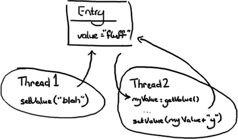

# Disruptor 为什么这么快

http://ifeve.com/disruptor/

## 锁的缺点

作为开发者`线程`一词出现,就意味着并发,而并发是困难的.

### 并发1

想象有两个线程尝试修改同一个变量 value 此时会有三种情况

情况一: 线程 1 先到达

- 变量value的值变为 ”blah”.
- 然后当线程２到达时，变量 value 的值变为 ”blahy”.

情况二: 线程 2 先到达

- 变量 value 的值变为 ”fluffy”.
- 然后当线程１到达时，值变为 ”blah”.

情况三: 线程 1 与线程 2 交互

- 线程 2 得到值 ＂fluff＂ 然后赋给本地变量 myValue.
- 线程 1 改变 value 的值为 ”blah”.
- 然后线程 2 醒来并把变量 value 的值改为 ”fluffy”.

情况三显然是唯一一个是错误的,但是如果线程 2 只是想把 ＂fluff＂ 改为 ”fluffy”，那么情况二和三都不正确.假定线程 2 想把值设为 ”fluffy”,有几种办法可以解决这个问题.

- 悲观锁
- 乐观锁

### 潜在问题-死锁

如果滥用锁技术,在两个线程需要访问两个资源时,两个锁都在获得锁的情况下尝试去获得另外一个锁,那就是你应该重启你的电脑的时候了.

### Disrutor 如何解决这些问题

Disruptor 根本就不用锁或使用乐观锁,在需要确保操作是线程安全的地方,我们使用CAS(Compare And Swap/Set)操作.这是一个 CPU 级别的指令，在我的意识中，它的工作方式有点像乐观锁——CPU去更新一个值，但如果想改的值不再是原来的值，操作就失败，因为很明显，有其它操作先改变了这个值。

