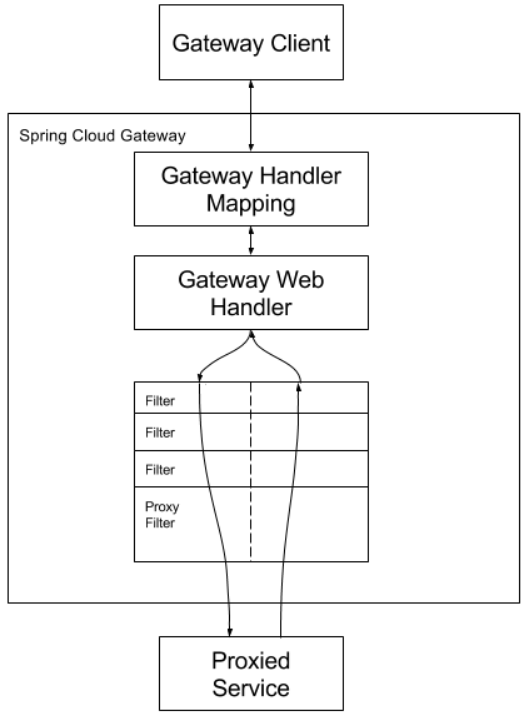

# Spring Cloud Gateway
## 概念

- Route: 网关的基本构成部分。它由一个ID、一个目的地URI、一个谓词集合和一个过滤器集合定义。如果集合谓词为真，则路由被匹配。
- Predicate: 这是一个Java 8函数谓词。输入类型是Spring Framework ServerWebExchange。这可以让你在HTTP请求中的任何内容上进行匹配，如头文件或参数。
- Filter: 这些是GatewayFilter的实例，是用特定工厂构建的。在这里，你可以在发送下游请求之前或之后修改请求和响应。

## How It Works

下图提供了一个关于Spring Cloud Gateway如何工作的高层次概述.



客户端向Spring Cloud Gateway发出请求。如果Gateway处理程序映射确定一个请求与路由相匹配，它将被发送到Gateway Web处理程序。这个处理程序通过一个特定于该请求的过滤器链来运行该请求。过滤器被虚线划分的原因是，过滤器可以在代理请求发送之前和之后运行逻辑。所有的 "前 "过滤器逻辑都被执行。然后发出代理请求。在代理请求发出后，"后 "过滤器逻辑被运行。

> 在路由中定义的没有端口的URI，其HTTP和HTTPS URI的默认端口值分别为80和443。

## 配置路由谓词因子和网关过滤因子

有两种方式可以配置谓词和过滤器：快捷方式和完全展开参数。下面的大多数例子使用的是快捷方式。

名称和参数名称将作为代码列在每个部分的第一句或第二句。参数通常按照快捷方式配置所需的顺序列出。

### 快捷配置

捷径配置是由过滤器名称识别的，后面是等号（=），后面是用逗号（,）分隔的参数值。

```yaml
spring:
  cloud:
    gateway:
      routes:
      - id: after_route
        uri: https://example.org
        predicates:
        - Cookie=mycookie,mycookievalue
```

前面的例子定义了Cookie Route Predicate Factory，有两个参数，cookie名称，mycookie和要匹配mycookievalue的值。

### 全面配置

完全展开的参数看起来更像标准的yaml配置，有名称/价值对。一般来说，会有一个name键和一个args键。args键是一个键值对的映射，用于配置谓词或过滤器。

```yaml
spring:
  cloud:
    gateway:
      routes:
      - id: after_route
        uri: https://example.org
        predicates:
        - name: Cookie
          args:
            name: mycookie
            regexp: mycookievalue
```

这是上面显示的Cookie谓词的快捷配置的完整配置。

## 